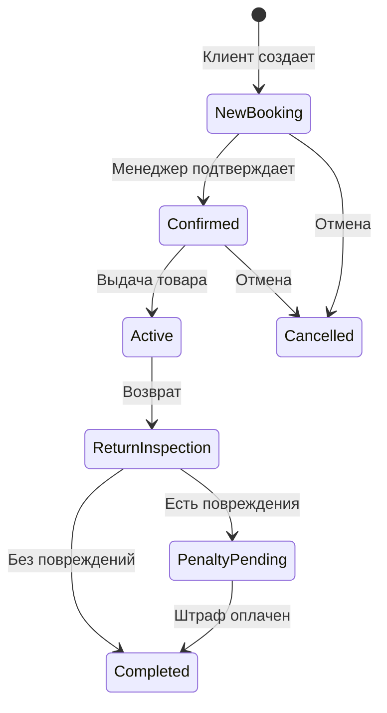
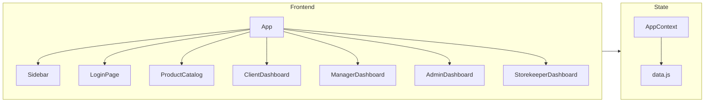

# Архитектура системы аренды одежды "Atelier Rental"

```mermaid
flowchart TB
    subgraph UI["🎨 Presentation Layer (React + Vite)"]
        direction TB
        App["App.jsx<br/>Router & Role-based rendering"]
        Sidebar["Sidebar.jsx<br/>Role-specific Navigation"]
        UIKit["ui.jsx<br/>Shared Components<br/>Badge / Modal / StarRating"]

        subgraph Pages["Pages"]
            Login["LoginPage"]
            Guest["GuestPage"]
            Catalog["ProductCatalog"]
            ClientDash["ClientDashboard<br/>Bookings / History / Reviews"]
            ManagerDash["ManagerDashboard<br/>Bookings / Agreements / Products"]
            AdminDash["AdminDashboard<br/>Dashboard / Users / Reports"]
            StoreDash["StorekeeperDashboard<br/>Inventory / Returns / Products"]
        end
    end

    subgraph State["⚙️ State Management (Context + Reducer)"]
        direction TB
        Context["AppContext.jsx<br/>React Context + useReducer"]
        Actions["Actions<br/>LOGIN / LOGOUT / CREATE_BOOKING<br/>ADD_PRODUCT / MANAGE_USERS<br/>RETURN / INSPECTION / PAY"]
    end

    subgraph Data["💾 Data Layer (In-Memory)"]
        direction TB
        SeedData["data.js<br/>Seed Data & Constants"]
        Users["👤 Users<br/>10 users, 5 roles"]
        Products["👗 Products<br/>18 items, 7 categories"]
        Bookings["📋 Bookings<br/>8 bookings, status lifecycle"]
        Agreements["📄 RentalAgreements<br/>Linked to bookings"]
        Payments["💰 Payments<br/>Payment history"]
        Reviews["⭐ Reviews<br/>Product reviews"]
        Penalties["⚠️ Penalties<br/>Damage penalties"]
    end

    subgraph Roles["🔐 User Roles"]
        GuestRole["👤 Guest<br/>Browse catalog"]
        ClientRole["👥 Client<br/>Book / Review / History"]
        ManagerRole["📊 Manager<br/>Manage bookings & clients"]
        AdminRole["🛡️ Administrator<br/>Full access & reports"]
        StoreRole["📦 Storekeeper<br/>Inventory / Returns"]
    end

    UI --> State
    State --> Data
    Roles --> UI
    ClientRole --> ClientDash
    ManagerRole --> ManagerDash
    AdminRole --> AdminDash
    StoreRole --> StoreDash
    GuestRole --> Guest
    GuestRole --> Catalog
    ClientDash --> Catalog
    ManagerDash --> Bookings
    ManagerDash --> Agreements
    AdminDash --> Users
    AdminDash --> Products
    StoreDash --> Products
    App --> Login
    App --> Sidebar
    App --> Pages
    Sidebar --> UIKit
```

## Легенда

| Слой | Описание |
|------|----------|
| 🎨 Presentation Layer | React-компоненты, страницы, UI-kit |
| ⚙️ State Management | Context API + useReducer для управления состоянием |
| 💾 Data Layer | Начальные данные в памяти (имитация БД) |
| 🔐 User Roles | 5 ролей с разными правами доступа |

## Жизненный цикл бронирования

## Архитектура компонентов

## Маршруты по ролям

| Роль | Разделы |
|------|---------|
| **Guest** | Каталог товаров |
| **Client** | Каталог, Мои бронирования, История, Отзывы |
| **Manager** | Бронирования, Договоры, Клиенты, Товары |
| **Administrator** | Дашборд, Товары, Пользователи, Тарифы, Отчеты |
| **Storekeeper** | Инвентарь, Возвраты, Товары |
